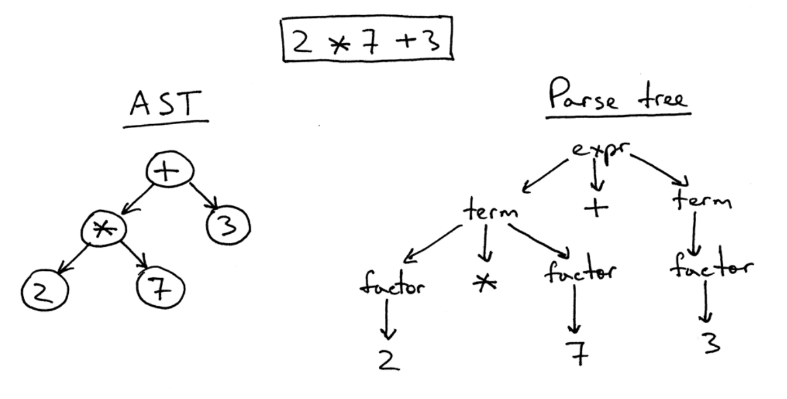

# Notação __LBN__(_Labelled Bracket Notation_) para __compL__

**Observação importante:**
As funções para implementação da geração de um programa em LBN a partir da AST de um programa estão em lbn.h e lbn.c.


## Notação para a Árvore Sintática Abstrata (Abstract Syntax Tree - AST)

Há diversas formas para representar árvores sintáticas corretas geradas
para um programa sintaticamente válido.
Em nosso projeto de compilador,
é importante definir e usar um formato único para representar
a AST, que seja independente de qualquer linguagem específica, seja fonte ou objeto.

Em nosso compilador,
o analisador sintático construirá uma AST para programas sem erros
(léxicos e sintáticos).
Para mostrar a AST criada,
a função _main_ chama a função _printAST_, tendo como argumento a raiz da AST,
para gerar uma representação da AST na notação _labelled bracketing_.

## Notação __LBN__ para representar AST

_Labelled Bracketing Notation (LBN)__ (notação de colchetes rotulados) 
é uma notação que representa a estrutura sintática hierárquica de frases 
usando colchetes aninhados (\([]\)) com rótulos. 
Ela funciona como uma representação textual para árvores sintáticas, 
marcando limites de suas partes para mostrar como as palavras se combinam.

A notação LBN permite definir listas aninhadas de _prefix expressions_ 
(operadores antes dos operandos),
usando colchetes para organizá-las. 
Cada colchete de abertura representa um nó de uma árvore
e cada colchete de fechamento marca o fim da influência desse nó.

### Exemplo

A LBN será usada para representar ASTs.



A AST para a expressão ``` 2 * 7 + 3```
é representada como ```[+ [* [2] [7]] [3]]``` na notação LBN.

Cada número inteiro NUM, é representado como ```[NUM]``` (seu valor entre colchetes),
por exemplo, ```[2] e [7]```,
e a operação de multiplicação entre dois números, como ```[* [2] [7]]```.

__Formato Geral__:

```
[operator [operand1] ... [operandN]]
```

Recursivamente, cada operando pode conter outra operação, por exemplo,
```
[op1 [op2 [a] [b]] [c]]
```
onde o operador ```op1``` possui os operandos ```[op2 [a] [b]]``` e ```[c]```,
e o operador ```op2``` tem como operandos ```[a]``` e ```[b]```.

## Listas de nós que podem ser mostrados na AST de compL

Tipos de nós que podem aparecem em uma AST e seus nomes correspondentes,
que deverão ser produzidos pelo analisador sintático para _compL_:

```[program  ... ]```

* ```[var-declaration  ... ]```

   * [type]                ---> tipo
   * [ID]                  ---> nome de variável

* ```[var-declaration  ... ]```  ---> com inicialização para tipos simples apenas

   * [type]                ---> tipo
   * [ID]                  ---> nome de variável
   * [expr]                ---> NUM, true ou false.

IMPORTANTE:
o símbolo de barra invertida (backslash \) é usado para
_não_ interpretar '[' ou ']' como nós de colchetes,
e sim para serem símbolos visíveis na AST.

* ```type``` pode ser:

     * [int]
     * [bool]
     * [array [NUM] [type]]

* ```[fun-declaration  ... ]```

   * [type] / [void]       ---> o nome do tipo retornado ou uso de void
   * [ID]                  ---> nome de função
   * [params  ...  ]       ---> gerar apenas [params], se não houver parâmetros na função
      * [param  ... ]      ---> (opcional) informação sobre parâmetro
         * [type]          ---> tipo, sendo que array não deve ter size
         * [ID]            ---> nome de variável
   * ```[block  ... ]```   ---> bloco (opções de filhos abaixo)

#### Blocos

* ```[block ... ] ```
   * [var-declaration]* ---> 0 ou mais declarações
   * [stmt]+            ---> ao menos um comando (statement)

####  Comandos

* ```[selection-stmt ... ]```     ---> ou comando IF
   * ver EXPRESSION               ---> definição recursiva de qualquer expressão válida
   * [stmt  ... ]                 ---> comando(s) do ramo "then" (true)
   * [stmt  ... ]                 ---> (opcional) comando(s) do ramo "else" (false)

* ```[iteration-stmt  ... ]```    ---> apenas "while"
   * ver EXPRESSION               ---> definição recursiva de qualquer expressão válida
   * [stmt ... ]                  ---> comando(s) do while (statements)

* ```[return-stmt ... ]```
      * [ ]                       ---> representa return ;
      * ver EXPRESSION            ---> definição recursiva de qualquer expressão válida

* ```[print-stmt ...]```          ---> ver lista de argumentos

* ```[assign-stmt ...]```

#### Expressões

* ```[OP [expr1] [expr2 ]```      ---> operadores de expressão binária
  ```OP pode ser: 
     +, -, *, /, <, <=, >, >=, ==, !=```

* ```[var  ... ]```               ---> uso de variável
   * [ID]
   * [expr]                       ---> uso de valor (literal) do tipo integer, se array

* ```[call  ... ]```              ---> chamada (call) de função
   * [ID]
   * [args ... ]                  ---> argumentos de função

* ```[OP [expr] []]```            ---> expressão unária

* ```[NUM]```

* ```[true] \ [false]```

* ```[ID]```


