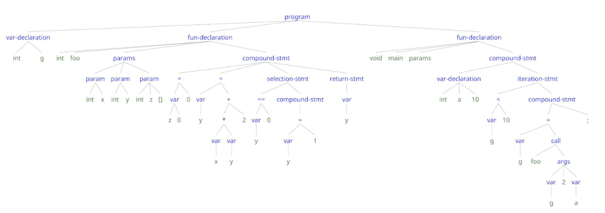

# Projeto e Implementação de um Compilador

- Parte 3 de 5
- Em dupla

## Trabalho 3 (T3): Construção da AST 

Implementação de analisador sintático para _compL_ 
que gera uma AST -- AST - Abstract Syntax Tree --
para cada programa analisado e sintaticamente válido. 
As funções para definição e criação de diferentes tipos de nós 
da AST para _compL_ estão definidas nos arquivos:
- decl.h e decl.c
- type.h e type.c
- param_list.h e param_list.c
- stmt.h e stmt.c
- expr.h e expr.c

A AST gerada para um programa sintaticamente válido
deve ser mostrada em notação textual na forma de __labelled brackets__
[LBN](./LBN-especificacao.md).
As funções para gerar o programa a partir de sua AST pem LBN estão definidas
em `lbn.h` e `lbn.c`.

## Exemplo para compL

### Entrada

```
min: integer;
x: integer;
main: function void () {
   min = 1;
   x = 0; 
   print(min);
}
```

#### Saída

```
[program
  [var-declaration [integer][min]]
  [var-declaration [integer][x]]
  [fun-declaration
    [void]
    [main]
    [params]
    [block
       [= [var [min]] [1]]
       [= [var [x]] [0]]
       [print-stmt [args [var [min]]]]
     ]
   ]
]
```

#### Ilustração de AST gerada com a ferramenta 
[RSyntaxTree](https://yohasebe.com/rsyntaxtree/)




### Descrição 

O analisador sintático para _compL_ desenvolvido no trabalho 2 (T2) 
será o ponto de partida para o T3.
As regras de produção da gramática bison devem
ser modificadas e incluir ações semânticas para a construção dos nós 
e sub-árvores da AST das folhas para a raiz, usando
as funções definidas nos arquivos para criação da AST.

O trabalho T3 inclui a modificação do analisador sintático do trabalho T2, 
construído com a ferramenta _Bison_, o uso correto
de funções auxiliares para a construção da AST 
durante o processo de análise sintática, 
e o uso da função _printAST_ e associadas para gerar uma representação externa 
LBN para a AST.

O analisador sintático gerado pelo Bison, _yyparse()_, 
deve receber uma sequência de _tokens_ enviados pelo analisador léxico _yylex()_, 
e determinar se um programa _compL_ segue ou não a especificação 
definida por sua gramática.
Em caso de sucesso, o analisador sintático retorna uma referência (link)
para a raiz da AST construída, 
a ser usada pela função _printAST_ (fornecida no material).
Em caso de erro sintático detectado, 
a mensagem de erro padrão do Bison (em inglês) 
deverá ser reportada e a análise sintática deve ser interrompida.

As funções auxiliares para a criação e manipulação da AST e
para a geração de uma representação usando a notação LBN  para a AST criada
são fornecidas na pasta __T3__ do repositório.

Antes de iniciar a implementação do T3 em equipe, 
recomendamos a leitura dos capítulos 5 e 6 do livro 
"Introduction to Compilers and Language Design" de Douglas Thain
e o capítulo 3 do livro "Flex&Bison".
Apesar da sintaxe de _compL_ ser um pouco diferente da usada no livro de Thain, 
os exemplos de código e o material são úteis.
Recomendamos fortemente que os exercícios E2, E3 e E4 
sejam resolvidos antes de começar o trabalho T3.

## Analisador sintático em Bison com Construção de AST

Preparação: Usar a gramática para _compL_ validada no trabalho T2.
- **Atenção**: Ler [aspectos sintáticos](./T2-especificacao-revisada.md) de _compL_ 
-- versão melhorada da especificação disponibilizada para T2.
- Usar o programa Bison desenvolvido em T2 (t2.y) como ponto de partida.
- Adaptar o programa Flex usado em T2 (t2.l) para passar os valores de constantes
numéricas e lexemas de identificadores como atributos dos tokens retornados.

Copiar o código de _t2.l_ para _t3.l_.
O programa t3.l deve converter os lexemas das constantes numéricas, 
por exemplo, NUM (tipo integer) para valor inteiro
e também copiar o lexema de identificadores (ID) para envio ao analisador sintático.

- **Atenção**: Você deverá usar as diretivas %union para definir YYSTYPE
e %type para associar tipo aos não-terminais do programa Bison.
Ler sobre a variável yylval, YYSTYPE, %union e %type no livro Flex&Bison. 
Ler o capítulo 6 do livro de D.Thain para entender os tipos dos nós da AST.

### Construção da AST

Incluir ações semânticas nas regras de produção 
para construir a AST ao longo da análise sintática ascendente.
Usar as  estruturas de dados e funções para criação e manipulação da AST 
estão em arquivos .c e .h na pasta T3, sem modificar o código das mesmas.

### Geração de representação externa para a AST

A função _main_ está definida em um arquivo C chamado de _main.c_.
- A função _main_ chama a função _printAST_
para geração de saída representada na notação _labelled bracket_ (LBN),
passando como argumento o endereço da raiz da AST 
construída durante a análise sintática.

### Notação para a Árvore Sintática Abstrata (Abstract Syntax Tree - AST)

- Ver notação [LBN](./LBN-especificacao.md).

### Compilação e Execução

O arquivo _makefile_ contém instruções para compilar os arquivos 
e gerar o executável _compl_: ```make compile```.

Para limpar os arquivos temporários,
use o comando ```make clean```.

A função _main_  chama a função _yyparse()_ que, em caso de sucesso,
coloca o endereço da raiz da AST na variável _parser_result_, 
e chama a função _printAST_  para gerar a representação da AST 
na notação LBN.

Em caso de erro sintático identificado, 
a mensagem "syntax error" e o número da linha onde o erro se manifesta
serão reportados (ver _main.c_)
e a análise interrompida, sem geração de AST.

### Testes

Os casos de teste estão disponíveis na pasta ```/tests``` do repositório.

Há scripts para rodar os testes localmente, antes de subir para o GitHub.

### Entrega 

- arquivo t3.l
- arquivo t3.y com ações semânticas que usam as funções fornecidas nos arquivos *.c

Não modificar os demais arquivos.

### Correção Automática

A correção automática do trabalho será feita com o apoio de _scripts_.
Desse modo, a correção irá considerar apenas os arquivos colocados 
no repositório GitHub da equipe,
com os nomes de arquivos indicados na especificação do trabalho.

--------
Parte deste material foi traduzido pela Prof. Christina von Flach a partir do livro de Douglas Thain e notas de aula do Prof. Vinicius Petrucci.

